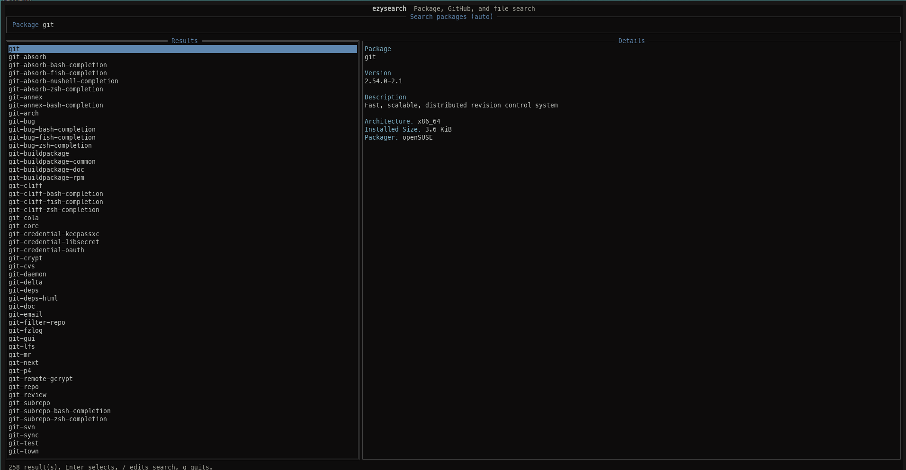

# ezysearch

A cross-platform package explorer written in Go.

ezysearch is a terminal-based application that provides a unified interface for searching, inspecting, and installing packages across different operating systems.



## Features

- **Cross-platform package search**: Works with pacman/yay (Arch), apt (Debian/Ubuntu), brew (macOS), dnf (Fedora), and zypper (openSUSE)
- **Package details**: Preview package metadata before installing
- **Package scripts**: Inspect supported package build/install scripts from the TUI
- **Interactive TUI**: User-friendly terminal interface built with tview
- **Fuzzy search**: Quickly find what you're looking for

## Installation

### Go install

```bash
go install github.com/tumillanino/ezysearch@latest
```

Make sure `$(go env GOPATH)/bin` is on your `PATH`, then run `ezysearch`.

### From source

```bash
# Build from a checked-out source tree
make build

# Install
sudo make install
```

### Requirements

- Go 1.21 or later
- Supported package manager (pacman/yay, apt, brew, dnf, or zypper)

## Usage

Run ezysearch from your terminal:

```bash
ezysearch
```

Useful command-line flags:

```bash
ezysearch --help
ezysearch --version
ezysearch --doctor
ezysearch --config-path
ezysearch --print-config
ezysearch --default-config
ezysearch --list-package-managers
ezysearch --completion zsh
```

To force a package manager instead of using auto-detection:

```bash
ezysearch --homebrew
ezysearch --dnf
ezysearch --package-manager brew
```

Supported package-manager flags are `--auto`, `--yay`, `--pacman`, `--apt`, `--brew`, `--homebrew`, `--hombrew`, `--dnf`, and `--zypper`.

### Key Bindings

- `Ctrl+P` - Package search
- `Enter` - Execute search or select item
- `Esc` - Return to previous view
- `Ctrl+C` - Quit

## Configuration

ezysearch creates a TOML configuration file at `~/.config/ezysearch/config.toml` with the following options:

```toml
package_search_key = "Ctrl+P"
cache_expiry = 60

[package_manager]
sudo = "sudo"
confirm_install = true
pacman_flags = []
apt_flags = []
dnf_flags = []
zypper_flags = []
brew_flags = []
yay_flags = []

[ui]
color_scheme = "default"
show_package_count = true
```

## License

MIT
